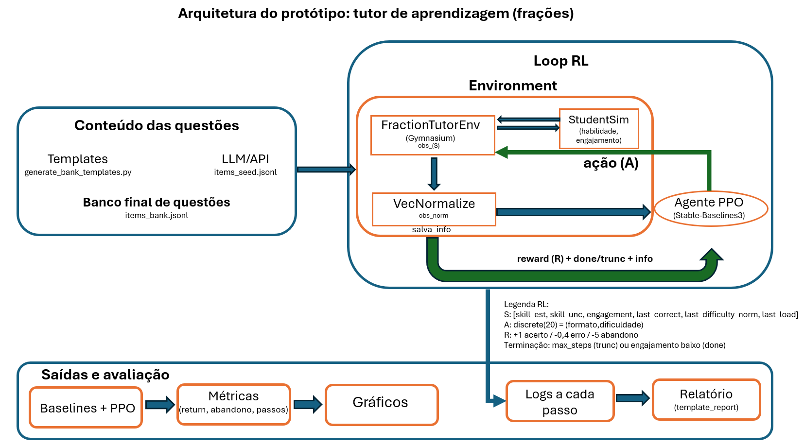

# Fractions RL Tutor (Desafio ICTi 2026)

Este repositório contém um protótipo de um tutor adaptativo de exercícios de frações usando RL:
- **Banco de questões** em JSONL (estático; pode ser gerado offline via templates).
- **Ambiente Gymnasium** com um estudante simulado (habilidade + engajamento).
- **Treinamento com PPO** (Stable-Baselines3) + avaliação de baselines.
- Relatório pós-sessão simples (template-based)

## Estrutura (arquivos principais)

- `Apresentacao_desafioicti2026.ipynb`: notebook principal (pipeline completo: banco → baselines → PPO → gráficos → relatório).
- `tutor/envs/fraction_tutor_env.py`: ambiente RL (núcleo).
- `tutor/student_sim.py`: simulador de estudante (habilidade/engajamento).
- `tutor/question_bank.py`: leitura/seleção de itens (JSONL).
- `scripts/generate_bank_templates.py`: gera banco grande offline (sem API).
- `train_ppo.py`: treino do PPO.
- `eval_baselines.py`: comparação de baselines vs PPO.
- `figs/arquiteturaRL.png`: diagrama da arquitetura RL.

## Arquitetura (visão geral)



## O que o ambiente modela

O ambiente principal é `tutor/envs/fraction_tutor_env.py`.

### Espaço de ações
A ação escolhe um par `(formato, dificuldade)`:

- `formato ∈ {short_text, multiple_choice, visual, scaffold}`
- `dificuldade ∈ {1, 2, 3, 4, 5}`

Total: `4 × 5 = 20` ações.

### Observação
Vetor de estado retornado pelo `env`:

`[skill_est, skill_unc, engagement, last_correct, last_difficulty_norm, last_load]`

- `skill_est`: estimativa da habilidade do estudante (limitada em `[-3, 3]`)
- `skill_unc`: incerteza/variabilidade da estimativa
- `engagement`: `[0,1]`, cai com carga de leitura/dificuldade e pode encerrar o episódio
- `last_correct`: `0/1` (se a última questão foi acertada)
- `last_difficulty_norm`: dificuldade normalizada em `[0,1]`
- `last_load`: proxy de carga/leitura em `[0,1]`

### Recompensa
- `+1.0` se correto  
- `-0.4` se errado  
- Se o `engagement` cai abaixo de um limiar: episódio termina com penalidade extra `-5.0` (considerado “abandono”)


## Baselines e avaliação
Baselines implementadas:
- `random`: escolhe uma ação aleatória.
- `staircase`: ajusta dificuldade por acerto/erro com formato fixo (`multiple_choice`).
- `eng-aware`: ajusta dificuldade por acerto/erro e escolhe formatos mais leves quando `engagement` está baixo.

Métricas:
- `mean_return`
- `abandon_rate`
- `mean_steps` (tipicamente ~ `max_steps` quando abandono é raro)

## PPO com 3 seeds

Para reduzir a variância típica de RL, o PPO também foi treinado com **3 seeds** (`0, 1, 2`) e reportamos **média ± desvio padrão** das métricas entre seeds.  
O código deste experimento multi-seed está no notebook `Apresentacao_desafioicti2026.ipynb`.


## Uso de LLM/API (opcional)
O uso de LLM/API é opcional e fica fora do loop de treino: serve apenas para gerar itens seed (variações/distratores) em JSONL e complementar o banco offline.  

O core de RL é 100% reproduzível apenas com o gerador de templates (`scripts/generate_bank_templates.py`), sem necessidade de chaves de API.


## Quickstart

```bash
python -m venv .venv
source .venv/bin/activate   # (Windows: .venv\Scripts\activate)
pip install -r requirements.txt

# gerar um banco grande offline (sem API keys)
python scripts/generate_bank_templates.py --out data/items_bank.jsonl --n_per_cell 12 --seed 42

# treinar PPO (salva em models/)
python train_ppo.py --bank data/items_bank.jsonl --timesteps 200000 --seed 0 --out models/ppo_20actions.zip

# avaliar baselines vs PPO
python eval_baselines.py --bank data/items_bank.jsonl --model models/ppo_20actions.zip --episodes 200 --seed 1

# treinar e avaliar PPO com 3 seeds
python train_ppo.py --bank data/items_bank.jsonl --timesteps 50000 --seed 0 --out models/ppo_seed0.zip --vecnorm models/vecnormalize_seed0.pkl
python train_ppo.py --bank data/items_bank.jsonl --timesteps 50000 --seed 1 --out models/ppo_seed1.zip --vecnorm models/vecnormalize_seed1.pkl
python train_ppo.py --bank data/items_bank.jsonl --timesteps 50000 --seed 2 --out models/ppo_seed2.zip --vecnorm models/vecnormalize_seed2.pkl
